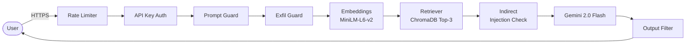

# Security-First RAG System

A security-hardened Retrieval-Augmented Generation API. Ingests PDF documents, answers questions with citations, and defends against prompt injection, data exfiltration, and PII leakage.

## Deployment Platform Change

This project was originally designed for deployment on Azure (utilizing Azure Container Apps, Key Vault, and Blob Storage). However, due to Azure subscription and account limitations, **it has been fully migrated to Render**. 

The migration preserves the same security goals and architecture principles while adapting to Render's deployment ecosystem.

## Architecture



**Stack**: FastAPI · ChromaDB · sentence-transformers · Gemini Free API · Render Web Service

## Quick Start

```bash
# 1. Clone and configure
cp .env.example .env
# Edit .env: set GEMINI_API_KEY and APP_API_KEYS

# 2. Run with Docker
docker-compose -f docker/docker-compose.yml up --build

# 3. Generate sample PDFs
pip install fpdf2 && python scripts/generate_sample_pdfs.py

# 4. Ingest documents
curl -X POST http://localhost:8000/ingest \
  -H "X-API-Key: YOUR_KEY" \
  -F "files=@sample_pdfs/employee_handbook.pdf"

# 5. Query
curl -X POST http://localhost:8000/query \
  -H "X-API-Key: YOUR_KEY" \
  -H "Content-Type: application/json" \
  -d '{"question": "What is the refund policy?"}'
```

## Security Features

* **Prompt injection defense**: 12+ regex patterns with weighted scoring block direct injection attempts.
* **Jailbreak protection**: Detects DAN/developer-mode activations.
* **Data exfiltration protection**: Blocks bulk-request patterns and enumeration attempts.
* **Indirect Prompt Injection Check**: Analyzes document content *before* sending to the LLM to prevent document-embedded attacks.
* **PII masking**: Generic NER replacement for emails, phones, SSNs, and credit cards.
* **Rate limiting**: API abuse prevention (10/min query, 5/min ingest).
* **Authentication**: API key authentication with constant-time comparison to prevent timing side-channel attacks.
* **Output filtering**: Final regex sweep to catch leaked secrets/PII before returning to the user.

## Secret Management

Secrets (such as the Gemini API key and internal App API keys) are managed using **Render Environment Variables**. Keys are injected securely into the application container at runtime. Secrets are never hardcoded in the codebase, and sensitive fields are masked in all logging outputs.

## Logging and Monitoring

The application uses standard Python structured logging which streams directly to **Render Logs**. A global PII masking filter is applied to the logging subsystem—ensuring that even in the event of an error, raw PII or secret values are never logged to the Render dashboard.

## Storage Strategy

Uploaded PDFs are processed entirely in-memory for text extraction and chunking. They are never saved to a public or accessible local disk directory.
The extracted embeddings are saved to ChromaDB. ChromaDB persistence is mapped to the local filesystem (`./chroma_data`).

## Remaining Limitations

* **Ephemeral Storage on Free Tier**: Render Free Tier Web Services do not support Persistent Disks. As a result, the `chroma_data` directory is ephemeral. Any data ingested will be lost upon a container restart or deployment. For production use, a paid Render Starter plan is required to attach a Persistent Disk to the `/chroma_data` path.

## Threat Model

| Threat | Risk | Mitigation |
|--------|------|------------|
| Prompt Injection | HIGH | 12+ regex patterns, weighted scoring, hardened system prompt |
| Indirect Prompt Injection | HIGH | Document scanning, security delimiters, system prompt rules |
| Jailbreaks | HIGH | DAN/developer-mode detection, output filtering |
| Data Exfiltration | HIGH | 8+ exfiltration patterns, bulk-request blocking |
| Secret Leakage | CRITICAL | 9+ secret patterns in output filter, full response blocking |
| Unauthorized Access | CRITICAL | API keys, constant-time validation |
| Abuse | MEDIUM | Rate limiting (10/min query, 5/min ingest), per-IP |
| PII Exposure | HIGH | Global log masking, output redaction |

### Remaining Risk

**Adversarial Embedding Attacks**: An attacker with upload access could craft content with high cosine similarity to target queries but containing disinformation. Mitigation requires cross-document verification and content integrity hashing (future work).

## Azure-to-Render Mapping

| Azure Component | Render Equivalent | Trade-offs |
|-----------------|-------------------|------------|
| Azure App Service / Container Apps | Render Web Service | Similar deployment ease via Docker. |
| Azure Key Vault | Render Environment Variables | Environment variables are simpler but lack Key Vault's advanced rotation and audit logging. |
| Azure Monitor | Render Logs | Standard stdout streaming replaces OpenTelemetry. |
| Azure Blob Storage | In-Memory PDF Processing | No long-term raw document storage is kept, reducing attack surface. |
| Managed Identity | Environment Variable-Based Access | Simpler setup, but requires manual environment variable syncing. |

## API Endpoints

| Method | Path | Auth | Description |
|--------|------|------|-------------|
| POST | `/ingest` | ✅ | Upload PDFs, build vector index |
| POST | `/query` | ✅ | Ask questions, get cited answers |
| GET | `/health` | ❌ | Component health check |
| GET | `/security-status` | ❌ | Security feature inventory |

## Testing

```bash
pip install -r requirements.txt
pytest tests/ -v
```

## Render Deployment

To deploy to Render, you can connect this repository to your Render dashboard and create a new **Web Service**.
Alternatively, use the provided `render.yaml` as a Blueprint:

1. In the Render Dashboard, go to **Blueprints**.
2. Connect your repository.
3. Render will automatically detect `render.yaml` and provision the Web Service.
4. Supply your `GEMINI_API_KEY` and `APP_API_KEYS` environment variables in the dashboard.

See [docs/architecture.md](docs/architecture.md) for full architecture details, [docs/threat_model.md](docs/threat_model.md) for the complete threat model, and [docs/demo_script.md](docs/demo_script.md) for a 5-minute demo walkthrough.
