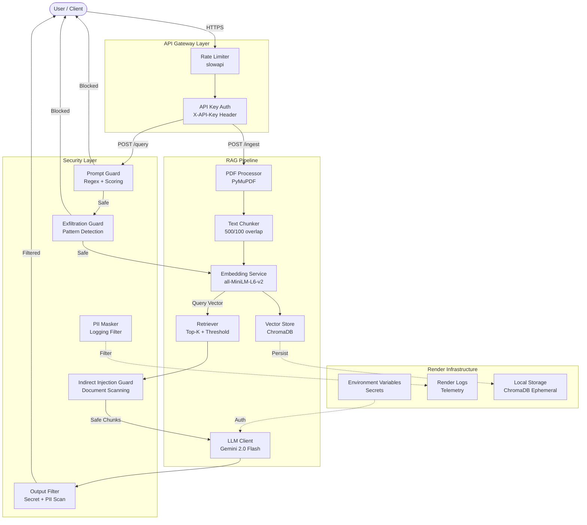

# Architecture

## System Overview



## Data Flow

### Ingestion Flow
```
PDF Upload → Validate (type, size) → Extract Text (PyMuPDF) 
→ Chunk (500 chars, 100 overlap) → Embed (all-MiniLM-L6-v2) 
→ Store (ChromaDB with metadata: filename, page, chunk_index)
```

### Query Flow
```
User Question → Rate Limit → API Auth → Prompt Guard → Exfiltration Guard
→ Embed Query → Retrieve Top-3 → Similarity Threshold Check
→ Indirect Injection Scan → Sanitize Context → LLM (Gemini)
→ Output Filter → Return Answer + Citations
```

## Component Details

| Component | Technology | Purpose |
|-----------|-----------|---------|
| Web Framework | FastAPI | Async API with OpenAPI docs |
| Embeddings | all-MiniLM-L6-v2 | 384-dim local embeddings |
| Vector DB | ChromaDB | Persistent cosine similarity search |
| LLM | Gemini 2.0 Flash | Free-tier answer generation |
| PDF Parser | PyMuPDF | Text extraction with page tracking |
| Auth | Custom middleware | API key with constant-time comparison |
| Rate Limit | slowapi | In-memory per-IP throttling |
| Secrets | Render Environment Variables | Secure injection at runtime |
| Storage | Local Ephemeral Storage | Processed in-memory, ephemeral vectors |
| Monitoring | Render Logs | Standard stdout with PII masking |
| Container | Docker | Multi-stage, non-root, health checked |
| Deployment | Render Web Service | Free Tier compatible |
